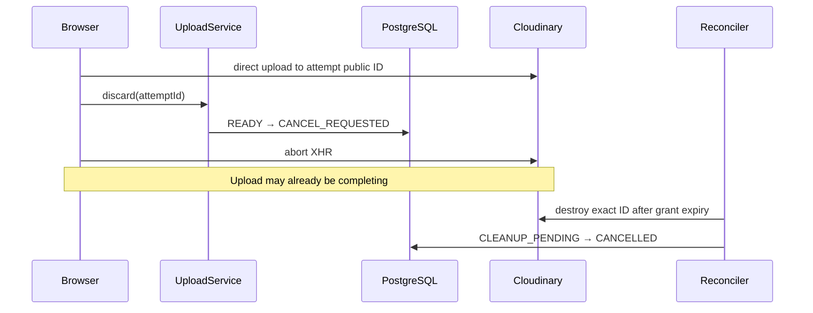
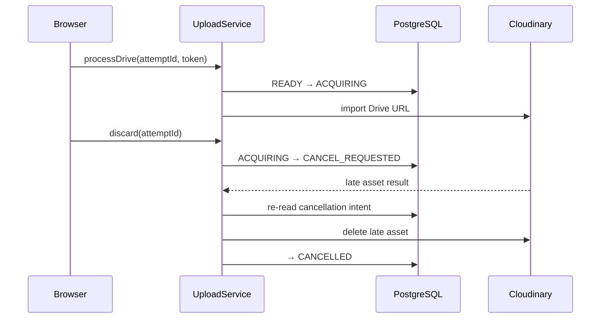

# Upload Attempt Lifecycle — Design Spec

**Task:** UPLOAD-002 / UPLOAD-003  
**Date:** 2026-06-23  
**Revision:** 2 — replaces the client-owned Upload Source protocol  
**Status:** Approved architecture — implementation plan pending

---

## 1. Decision

`UploadAttempt` is the authoritative record for an upload from the moment the
server accepts the photographer's intent until the attempt either produces one
draft `MediaItem` or is safely cancelled.

This does **not** route local file bytes through the application server:

- the browser creates the local preview immediately;
- the browser uploads local bytes directly to Cloudinary;
- the server stores only lifecycle metadata and issues an attempt-specific
  signed upload grant;
- Drive remains a server-to-Cloudinary remote import because the provider token
  is required to fetch the remote file;
- `MediaItem` becomes authoritative only after successful finalization.

The previous proposal put acquisition, queue state, persisted deletion,
Cloudinary cleanup, and Query invalidation into client-side source singletons.
That moved the existing synchronization problem without creating an authority
that survives queue clearing, reloads, lost responses, or process failure.

---

## 2. Product invariants

1. Selecting a local file shows a browser preview before any network request
   finishes.
2. Local file bytes travel browser → Cloudinary, never browser → app server →
   Cloudinary.
3. Every accepted upload intent has one owned server record and one deterministic
   Cloudinary public ID.
4. One attempt creates at most one `MediaItem`.
5. A cancellation request prevents future finalization even if acquisition
   completes late.
6. Failed database deletion remains user-visible; failed provider cleanup remains
   durable operational work.
7. Refreshing the page cannot silently forget an unresolved server attempt.
8. A draft cannot publish while an attempt may still create draft media.
9. OAuth access tokens are request-scoped and are never persisted, placed in a
   client store, or logged.
10. Query owns server attempt/media projections. Zustand owns only browser
    resources such as `File`, blob preview URL, upload percentage, and XHR abort.

---

## 3. Sources of truth

| Fact | Authority | Projection or cache |
|---|---|---|
| Selected local `File` | Browser transfer store | None; lost on reload |
| Local blob preview | Browser transfer store | None; revoked after release |
| Local upload percentage and XHR abort | Browser transfer store | None |
| Drive picker thumbnail | Browser transfer store | None |
| Upload lifecycle and cancellation intent | `UploadAttempt` row | TanStack Query |
| Intended/observed Cloudinary identity | `UploadAttempt` row | Attempt response |
| Completed draft media | `MediaItem` row | TanStack Query |
| Draft membership and publishability | `SurfSession` aggregate | TanStack Query |
| Google OAuth access token | Current call stack only | Never cached or persisted |
| Gallery cards | Derived from attempts + media + browser transfers | Never stored |

`UploadAttempt` is core only while acquiring or reconciling media. It does not
replace `MediaItem` after completion and does not replace `SurfSession` as owner
of draft membership and publication.

---

## 4. Domain model

### 4.1 Prisma model

```prisma
enum UploadSource {
  LOCAL
  DRIVE
}

enum UploadAttemptStatus {
  READY
  ACQUIRING
  FINALIZING
  COMPLETED
  FAILED
  CANCEL_REQUESTED
  CLEANUP_PENDING
  CANCELLED
}

model UploadAttempt {
  id                 String              @id @default(uuid())
  clientRequestId    String
  sessionId          String
  photographerId     String
  source             UploadSource
  status             UploadAttemptStatus @default(READY)

  // Generated by the server before acquisition begins.
  cloudinaryPublicId String              @unique
  expectedMediaType  MediaType

  // Drive provenance only. OAuth tokens are never persisted.
  remoteFileId       String?

  lastErrorCode      String?
  uploadGrantExpiresAt DateTime?
  expiresAt          DateTime
  createdAt          DateTime            @default(now())
  updatedAt          DateTime            @updatedAt

  session   SurfSession @relation(
    fields: [sessionId, photographerId],
    references: [id, photographerId]
  )
  mediaItem MediaItem?

  @@unique([photographerId, clientRequestId])
  @@index([sessionId, status])
  @@index([status, expiresAt])
}

model MediaItem {
  // Existing fields remain.
  uploadAttemptId String        @unique
  uploadAttempt   UploadAttempt @relation(
    fields: [uploadAttemptId],
    references: [id]
  )
}
```

### 4.2 Constraint meanings

- `(photographerId, clientRequestId)` makes a repeated browser command
  idempotent without trusting a globally unique client key.
- The composite session relationship prevents an attempt from being attached to
  another photographer's draft.
- `MediaItem.uploadAttemptId @unique` proves an attempt can produce no more than
  one persisted media row.
- `cloudinaryPublicId @unique` gives cleanup one exact, server-owned provider
  identity.
- `uploadGrantExpiresAt` defines when a cancelled local direct upload is safe to
  reconcile after a browser disappears.
- `expiresAt` is the query seam for reconciliation. It does not require a
  distributed job system.

Existing `MediaItem.importSource` and `remoteFileId` remain the completed-media
provenance. Finalization populates them from the attempt rather than trusting a
separate client copy.

---

## 5. State machine

```mermaid
stateDiagram-v2
  [*] --> READY: beginLocal / beginDrive

  READY --> ACQUIRING: process Drive import
  READY --> FINALIZING: finalize local upload
  ACQUIRING --> FINALIZING: Drive asset acquired
  FINALIZING --> COMPLETED: MediaItem created atomically

  READY --> FAILED: preparation failed
  ACQUIRING --> FAILED: provider import failed
  FINALIZING --> FAILED: recoverable finalization failed

  READY --> CANCEL_REQUESTED: discard
  ACQUIRING --> CANCEL_REQUESTED: discard
  FINALIZING --> CANCEL_REQUESTED: discard wins race
  FAILED --> CANCEL_REQUESTED: discard failed attempt
  COMPLETED --> CLEANUP_PENDING: discard completed draft media

  CANCEL_REQUESTED --> CLEANUP_PENDING: acquisition settled or grant expired
  CLEANUP_PENDING --> CANCELLED: provider asset absent
  CLEANUP_PENDING --> CLEANUP_PENDING: cleanup failed; retry safely
```



### 5.1 State rules

- `COMPLETED` and `CANCELLED` are successful terminal outcomes.
- `FAILED` is retryable or discardable and remains visible to the photographer.
  A local retry creates a new attempt from the same browser transfer: the
  coordinator issues `beginLocal` with a fresh `clientRequestId` and the stored
  `File`. A Drive retry requires a fresh OAuth token; the coordinator calls
  `requestDriveAccessToken` — re-prompting only if silent re-auth fails — then
  issues `beginDrive` and `processDrive` using the attempt's stored
  `remoteFileId`. Neither path resets or reuses the original failed attempt
  record.
- `CANCEL_REQUESTED` forbids finalization, even if Cloudinary returns success
  later.
- `CLEANUP_PENDING` cannot finalize. It records durable provider cleanup work.
- State transitions use conditional updates against allowed previous states.
  Absence from a browser queue is never a cancellation signal.
- A duplicate command reloads and returns the already-established result rather
  than repeating its side effect.

### 5.2 Publication rule

The server rejects publication while any attempt for the draft is still allowed
to create media: `READY`, `ACQUIRING`, `FINALIZING`, or retryable `FAILED`.

`CANCEL_REQUESTED`, `CLEANUP_PENDING`, and `CANCELLED` cannot create media and do
not block publication. Provider cleanup availability must not hold an otherwise
valid shoot hostage.

---

## 6. Server commands

Upload lifecycle commands move from `mediaRouter` to a dedicated
`uploadsRouter`. Completed-media editing and published-media deletion remain in
the Media domain.

### 6.1 `uploads.beginLocal`

Input:

```ts
{
  draftId: string;
  clientRequestId: string;
  declaredMimeType: string;
  declaredByteSize: number;
}
```

The server:

1. authenticates the photographer;
2. validates the owned editable draft and upload policy;
3. creates or returns the idempotent attempt;
4. generates an exact Cloudinary public ID scoped to photographer and attempt;
5. signs that exact target, resource policy, authenticated delivery type, and
   eager transforms;
6. stores the grant expiry;
7. returns `attemptId` plus the direct-upload grant.

The browser already has its preview and then sends the bytes directly to
Cloudinary.

### 6.2 `uploads.finalizeLocal`

Input:

```ts
{
  attemptId: string;
  providerReceipt: unknown;
  capturedAt?: Date;
}
```

The server validates the untrusted Cloudinary receipt at the adapter boundary.
The receipt must identify the attempt's exact public ID and permitted media type.
The server generates delivery URLs; it does not persist client-supplied URLs.

After provider verification, one database transaction:

1. conditionally claims an attempt eligible for finalization;
2. rechecks ownership and that the session is an editable draft;
3. creates exactly one `MediaItem` linked by `uploadAttemptId`;
4. records source provenance;
5. marks the attempt `COMPLETED`.

If cancellation won first, no `MediaItem` is created and the provider asset is
reconciled instead.

### 6.3 `uploads.beginDrive`

Input:

```ts
{
  draftId: string;
  clientRequestId: string;
  remoteFileId: string;
  declaredMimeType: string;
}
```

Output: `{ attemptId: string }`

Creates and returns the attempt before the long import starts. It records the
remote file ID and declared MIME type but never receives or persists the OAuth
token. The `clientRequestId` makes a repeated picker selection idempotent.

### 6.4 `uploads.processDrive`

Input:

```ts
{
  attemptId: string;
  accessToken: string;
}
```

The token exists only for this request. The service conditionally changes
`READY → ACQUIRING`, imports the remote file to the exact provider target, and
then re-reads the attempt before finalization.

If cancellation arrived during the import, the late asset is deleted and the
attempt proceeds to `CANCELLED`; no `MediaItem` is created.

### 6.5 `uploads.discard`

This command is idempotent and source-independent:

- before completion, it records `CANCEL_REQUESTED` and prevents finalization;
- during Drive acquisition, the acquisition owner deletes any late result;
- during a local direct upload, the browser aborts immediately while final
  provider cleanup waits until the signed grant cannot race with deletion;
- after completion but before publication, one transaction removes the draft
  `MediaItem` and records `CLEANUP_PENDING`;
- after publication, the command rejects because upload cancellation no longer
  owns published-media deletion;
- another call safely retries `CLEANUP_PENDING` work.

### 6.6 `uploads.discardDraft`

One server command replaces client-side `Promise.allSettled` orchestration:

1. validates one owned editable draft;
2. conditionally marks every nonterminal attempt so none can finalize;
3. removes every completed draft `MediaItem` atomically;
4. marks their attempts for cleanup;
5. commits before contacting Cloudinary;
6. reconciles provider assets independently and durably.

A database failure leaves all cards intact. Provider cleanup failure cannot
restore deleted draft media; it leaves identifiable `CLEANUP_PENDING` work.

### 6.7 `uploads.listForDraft`

Returns safe attempt projections for one owned draft. After refresh, a local file
and blob preview cannot be recovered, but the photographer sees an interrupted
attempt that can be discarded or restarted instead of the system forgetting it.

---

## 7. Concurrency and cleanup

### 7.1 Conditional transitions

State-changing repository methods use compare-and-set semantics:

```ts
updateMany({
  where: {
    id: attemptId,
    photographerId,
    status: { in: allowedPreviousStatuses },
  },
  data: { status: nextStatus },
});
```

If the count is zero, the service reloads the attempt and returns or reconciles
its established outcome. Long provider calls never hold database locks.

### 7.2 Local cancellation race



Deleting immediately is only an optimization. It is not the guarantee because a
racing direct upload could finish after an early delete. Grant-expiry
reconciliation is the final guarantee.

### 7.3 Drive cancellation race



The persisted cancellation intent replaces queue tombstones and singleton
`Set<string>` state.

### 7.4 Reconciliation

`UploadAttempt` itself is the durable cleanup work record. A small reconciler
claims expired `READY` and `FAILED` attempts (whose grant period has elapsed),
old `CANCEL_REQUESTED`, and `CLEANUP_PENDING` attempts, deletes the
deterministic provider target idempotently, and conditionally marks them
`CANCELLED`. Including expired `FAILED` attempts ensures that assets uploaded
before a finalization failure (the `FINALIZING → FAILED` path) are not
stranded permanently if the photographer retries with a new attempt rather than
discarding the old one.

The initial mechanism may be a simple scheduled database poll. No distributed
queue, durable progress stream, or cross-instance in-memory state is required.

---

## 8. Server module boundaries

```text
src/shared/
  types/upload.ts
  validation/uploadSchemas.ts

src/server/
  routes/uploads.ts
  services/UploadService.ts
  ports/UploadAssetStorage.ts
  repositories/UploadAttemptRepository.ts
  jobs/reconcileUploadAttempts.ts
```

### `types/upload.ts`

Owns upload enums and safe cross-boundary projections. It contains no Prisma,
Cloudinary SDK, OAuth token, or browser types.

### `validation/uploadSchemas.ts`

Owns runtime validation for every upload route and the provider receipt trust
boundary. Downstream internal propagation is typechecked rather than repeatedly
shape-tested.

### `routes/uploads.ts`

Owns authentication, input parsing, rate limiting, and transport error mapping.
It contains no workflow policy or SQL.

### `services/UploadService.ts`

Owns begin, acquisition, finalization, cancellation, discard, and reconciliation
policy. It depends on repositories and narrow provider ports, not Prisma or the
Cloudinary SDK.

### `repositories/UploadAttemptRepository.ts`

Owns attempt persistence and use-case-named atomic operations such as
`finalizeIntoDraft` and `removeCompletedDraftMedia`. It never calls Cloudinary.

### `ports/UploadAssetStorage.ts`

Defines separate capabilities:

```ts
interface DirectUploadPort {
  createUploadGrant(target: UploadTarget): DirectUploadGrant;
  verifyUploadReceipt(receipt: unknown, target: UploadTarget): Promise<StoredAsset>;
}

interface RemoteImportPort {
  importRemoteFile(input: RemoteImportInput): Promise<StoredAsset>;
}

interface AssetCleanupPort {
  deleteAsset(asset: StoredAssetIdentity): Promise<void>;
}
```

`CloudinaryService` implements these ports. Consumers depend only on the
capability they use; no source is forced to implement meaningless no-op methods.

### `jobs/reconcileUploadAttempts.ts`

Provides scheduling mechanics only. Cleanup policy remains in `UploadService`.

---

## 9. Client module boundaries

```text
src/features/Upload/model/
  types.ts
  uploadStore.ts
  uploadCoordinator.ts
  useUploadCommands.ts
  useUploadManager.ts
  useUploadQueue.ts
  useClearUploadQueue.ts
  useGooglePicker.ts
  cloudinaryTransport.ts
```

### 9.1 Browser transfer values

The browser store uses a truthful discriminated union:

```ts
type BrowserTransfer =
  | {
      source: 'local';
      clientRequestId: string;
      attemptId?: string;
      file: File;
      previewUrl: string;
      progress: number;
      abort?: () => void;
    }
  | {
      source: 'drive';
      clientRequestId: string;
      attemptId?: string;
      previewUrl: string;
    };
```

The optional `attemptId` represents the short interval after the preview is
created but before `beginLocal` or `beginDrive` returns. The stable
`clientRequestId` correlates the immediate card with the idempotent server
command.

The store does not contain authoritative attempt status, `MediaItem`, provider
public IDs, or OAuth tokens.

### 9.2 `uploadCoordinator.ts`

A plain TypeScript coordinator owns browser orchestration. It is not a singleton
and receives:

```ts
type UploadCoordinatorDeps = {
  commands: UploadCommands;
  transferStore: UploadTransferStore;
  directTransport: DirectUploadTransport;
};
```

It creates previews, begins attempts, runs local direct uploads, reports browser
progress, finalizes, aborts locally, asks the server to discard, and releases
browser resources after authoritative outcomes. It imports neither tRPC nor
Query.

### 9.3 `useUploadCommands.ts`

Owns tRPC mutations and Query reconciliation for attempt and draft-media
projections. It replaces feature-level raw `trpcClient` calls.

### 9.4 `useUploadManager.ts`

Remains the thin React composition boundary and preserves the current public API
during migration:

```ts
addFiles(files)
remove(kind, id)
discardAll(cards)
retry(id)
```

It composes command functions, transfer storage, direct transport, and user
notifications. Async work continues through captured ordinary dependencies; no
module singleton is required.

`remove(kind, id)` resolves the related attempt and browser transfer internally,
so existing callers do not change. After authoritative deletion succeeds, the
coordinator releases any matching blob preview and removes the browser transfer.

`discardAll(cards)` returns a promise that settles when the authoritative
`uploads.discardDraft` database command succeeds or fails. The modal caller must
await it, keep the destructive action pending, close only on success, and remain
open with the cards intact on database failure.

`retry(id)` dispatches on the failed attempt's source. A local retry issues
`beginLocal` with a fresh `clientRequestId` and the existing `File` from the
browser transfer store. A Drive retry calls `requestDriveAccessToken` to obtain
a fresh access token — re-prompting the photographer only if silent re-auth
fails — then calls `beginDrive` and `processDrive` with the attempt's stored
`remoteFileId`. The failed attempt record is not modified.

### 9.5 `useGooglePicker.ts`

Owns only OAuth interaction, Picker presentation, and translation of chosen
documents. It passes the selection and request-scoped token to the manager and
does not write server lifecycle state or delete media.

### 9.6 `useUploadQueue.ts`

Derives gallery cards from:

- Query-backed nonterminal attempts;
- Query-backed draft `MediaItem` rows;
- browser-only transfer resources.

Once finalization succeeds, the `MediaItem` projection replaces the transient
card. The merged card list is computed, never persisted.

The updated `GalleryCard` union:

```ts
export type AttemptCard = {
  kind: 'attempt';
  /**
   * Stable UI key. Uses clientRequestId before the server responds,
   * then attemptId once beginLocal / beginDrive returns.
   */
  id: string;
  source: 'local' | 'drive';
  /**
   * 'pending': beginLocal / beginDrive has not yet returned (browser-only window).
   * UploadAttemptStatus values thereafter, sourced from the Query projection.
   */
  status: 'pending' | UploadAttemptStatus;
  previewUrl: string;
  /** Defined only for local source; derived from the browser XHR. */
  progress?: number;
  /** Populated from UploadAttempt.lastErrorCode when status is FAILED. */
  errorCode?: string;
};

export type DraftCard = {
  kind: 'draft';
  id: string;
  result: MediaItem;
};

export type GalleryCard = AttemptCard | DraftCard;
```

`'draft'` cards remain unchanged: they represent completed `MediaItem` rows that
have no associated nonterminal attempt. The existing `'uploading'` variant is
replaced by `'attempt'` during Stage 3; callers that currently dispatch on
`'uploading' | 'draft'` are updated in the same stage.

### 9.7 `useClearUploadQueue.ts`

After successful publication, this hook releases browser-only resources. It does
not delete server records or provider assets; those lifecycles were already
resolved by authoritative commands and publish policy.

---

## 10. UX behaviour

| Action | Behaviour |
|---|---|
| Select local file | Blob preview appears immediately; begin request follows |
| Local upload | Progress comes from browser XHR; bytes go directly to Cloudinary |
| Select Drive file | Picker thumbnail appears; server attempt exists before long import |
| Remove active item | Card enters cancelling state; finalization becomes impossible |
| Remove completed draft item | DB removal commits before card disappears; provider cleanup is durable |
| Discard all | Button waits for one server transaction; modal stays open on DB failure |
| Cleanup provider outage | Deleted draft media stays deleted; attempt remains operationally retryable |
| Refresh during local upload | File is unavailable; interrupted attempt can be discarded/restarted |
| Refresh during Drive import | Server attempt remains visible and converges to completed/failed/cancelled |
| Publish | Server rejects only attempts that may still create or retry media |

`discardAll` awaits the authoritative database command before closing the modal.
It does not wait for every provider deletion because that work is persisted and
cannot change the draft outcome.

---

## 11. Migration

Create a new incremental Prisma migration after
`20260622192500_media_belongs_to_surf_session`:

1. create upload enums and `upload_attempts`;
2. add nullable `media_items.upload_attempt_id`;
3. preflight duplicated Cloudinary IDs and invalid session ownership;
4. backfill one `COMPLETED` attempt per existing media row using
   `importSource`, `remoteFileId`, session, photographer, resource type, and
   Cloudinary public ID;
5. link every media row to its generated attempt;
6. add unique and required constraints;
7. add composite ownership foreign keys and reconciliation indexes.

Do not edit the baseline migration or rely on a manually updated development
database.

---

## 12. Verification ownership

| Invariant | Owning verification |
|---|---|
| Immediate local preview | Focused client behaviour test |
| Browser uploads local bytes directly to Cloudinary | Transport contract + coordinator test |
| Attempt belongs to owned editable draft | Repository integration test |
| Idempotency key produces one attempt | Concurrent PostgreSQL integration test |
| One attempt creates one MediaItem maximum | DB unique constraint + integration test |
| Finalize/cancel race has one valid outcome | Repository/service concurrency test |
| Drive late success after cancellation is deleted | UploadService test with controlled adapter |
| Cleanup failure persists `CLEANUP_PENDING` | Service + repository integration test |
| Duplicate finalize returns existing media | Service/repository integration test |
| Discard-draft changes DB rows atomically | Repository integration test |
| Provider receipt translates or rejects raw response | One adapter contract test |
| OAuth token is not persisted | Type/static dependency verification |
| Local/Drive browser resources cannot mix | TypeScript build/typecheck |
| Card remains on authoritative DB failure | Focused client behaviour test |
| Publish rejects attempts that may still create media | SurfSession integration test |
| Dependency direction | ESLint architecture rules |
| Route/export/module wiring | Lint + production build |

Do not add runtime tests whose primary assertion is `sourceType`, an internal
field name, interface shape, or forwarding between typed internal layers.

Final verification sequence:

```text
npm run test:db:up
npm run test:integration
npm run test:server
npm run test:client
npm run lint
npm run build
npm run test:db:down
```

---

## 13. Implementation stages

### Stage 1 — Persisted contract

- shared types and validation;
- migration and backfill;
- attempt repository;
- atomic begin/finalize/cancel transitions;
- PostgreSQL integration tests.

### Stage 2 — Server application boundary

- narrow provider ports;
- `UploadService`;
- `uploadsRouter`;
- exact public-ID signing and receipt verification;
- Drive acquisition and source-independent discard;
- service tests.

Old Media upload endpoints remain temporarily available but are not used in
parallel for the same attempt.

### Stage 3 — Client ownership split

- browser transfer union and store;
- Query-backed attempts;
- upload command mutations;
- coordinator;
- picker-only Drive hook;
- thin manager preserving the public UI API;
- focused client behaviour tests.

### Stage 4 — Discard and publication

- one-attempt discard;
- atomic `discardDraft`;
- cleanup-pending presentation/observability;
- server publish policy;
- browser-only post-publish release.

### Stage 5 — Reconciliation and observability

- candidate claim query;
- simple scheduled reconciler;
- structured logs carrying attempt ID;
- counters for expired attempts and cleanup failures.

### Stage 6 — Remove legacy paths

After both local and Drive use attempts, remove:

- `media.signCloudinary`;
- client-controlled `media.create`;
- `media.registerDriveImport`;
- `media.deleteOrphanAsset`;
- raw upload `mediaApi.ts` calls;
- duplicated client cleanup branches.

Add lint boundaries preventing feature code from importing the raw tRPC client
or provider SDKs.

---

## 14. Explicitly deferred mechanisms

- distributed job queue;
- durable per-byte progress streaming;
- multi-region cleanup coordination;
- provider-independent resumable multipart upload;
- long-term attempt archival/partitioning.

The ports, persisted state, deterministic asset identity, and conditional
transitions are the seams required to add those mechanisms without changing
domain ownership.

---

## 15. Architecture recommendation

**Ideal architecture:** Server-authoritative `UploadAttempt`, narrow acquisition
and storage ports, browser-only transfer resources, and exactly-once
`MediaItem` finalization.

**Recommended for this app:** The same boundaries, with one simple reconciler
instead of distributed workers.

**Transitional fix:** Temporary compatibility routes are allowed only while
moving both existing sources. Do not implement the former client source
singletons as an intermediate architecture.

**Why they differ:** The ownership and contracts do not differ. Only the cleanup
execution mechanism is proportionate to the app's current scale.

---

## 16. Historical review of superseded revision 1

The findings below are preserved as the review record for the former
client-owned `UploadSource` proposal. Every finding has been dispositioned in
revision 2: the diagnoses are accepted, while ARCH-01's suggested client-memory
fix is appealed in favour of durable server cancellation.

### ARCH-01 — `clearQueue` race condition for in-flight Drive imports (high)

**Status:** Resolved by revision 2.

**Broken invariant:** A Drive item in `importing` status that gets discarded while
`registerDriveImport` is still in flight must have its DB row deleted when the
import eventually resolves.

Revision 1 changed the queue item to `cancelling` and then cleared it, so the late
Drive completion could no longer observe cancellation. The review proposed a
singleton `cancelledIds: Set<string>` or retaining `cancelling` queue items.

**Resolution:** The diagnosis is accepted; the preferred client `Set` fix is
appealed. Revision 2 persists cancellation on `UploadAttempt`. `processDrive`
re-reads the server record before finalization, and a late asset is deleted when
the attempt is `CANCEL_REQUESTED`. Cancellation no longer depends on browser
queue membership and survives reloads, lost responses, and process failure.

---

### CON-01 — `'cancelling'` missing from `UploadStatus` (high)

**Status:** Resolved by revision 2.

Revision 1 wrote `status: 'cancelling'`, but the existing `UploadStatus` union
contained only:

```text
pending | signing | uploading | saving | completed | error | importing | cancelled
```

The revision 1 files-changed list did not include the required state-contract
change.

**Resolution:** Revision 2 removes this proposed write entirely. Authoritative
cancellation is `UploadAttemptStatus.CANCEL_REQUESTED`; the card derives its
immediate “Cancelling…” presentation from the pending discard mutation and then
the Query-backed attempt status. The old client `UploadStatus` does not gain a
second cancellation spelling.

---

### PAT-01 — `remove` signature change breaks existing callers (high)

**Status:** Resolved by plan adjustment.

Revision 1 claimed the public API was unchanged while changing `remove(kind, id)`
to `remove(card)`. Existing `StepModeModal` and `UploadCardRenderer` callers use
the former signature.

**Resolution:** Revision 2 explicitly preserves `remove(kind, id)` during the
client migration. `useUploadManager` resolves the related attempt and browser
transfer internally, so no caller signature changes are hidden from the files
and implementation plan.

---

### PAT-02 — `discardAll` became async but its caller did not await (medium-high)

**Status:** Resolved by plan adjustment.

Revision 1 made `discardAll` asynchronous while `StepModeModal` invoked it
fire-and-forget and immediately closed the modal. The promised cancelling/error
UX therefore could not be observed.

**Resolution:** Revision 2 requires `StepModeModal` to await `discardAll`, disable
the destructive action while the authoritative database command is pending,
close only after success, and remain open on database failure. It does not wait
for Cloudinary cleanup because that work is durably represented by the attempt.

---

### ARCH-02 — `remove` dropped lingering-item cleanup (medium)

**Status:** Resolved by ownership change.

Revision 1 returned immediately after deleting a draft-kind card and omitted the
existing cleanup for a completed pipeline item with the same `mediaId`, leaving
a stale client card and blob preview.

**Resolution:** Revision 2 removes the duplicated completed-media state from
Zustand. Query owns completed `MediaItem` rows, while the coordinator explicitly
releases any browser transfer matching the deleted attempt after authoritative
deletion succeeds. There is no second completed pipeline item to synchronize.

---

### PERF-01 — Batch delete regressed to N individual deletes (low)

**Status:** Resolved by plan adjustment.

Revision 1 replaced one batch deletion with individual `deleteMedia` calls inside
`Promise.allSettled`, multiplying network requests by the number of cards.

**Resolution:** Revision 2 uses one `uploads.discardDraft` command. Its database
transaction removes all completed draft media and records cancellation/cleanup
state for every attempt; provider reconciliation happens from persisted work and
does not multiply browser-to-server requests.
