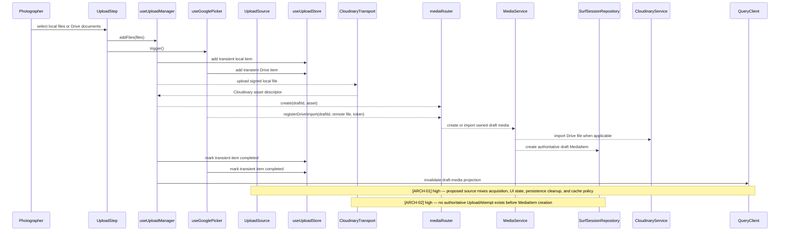
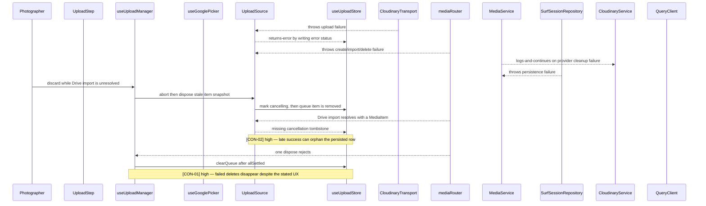

# Upload source protocol design review

## Happy path

## Error flow

## Architecture verdict

**Ideal architecture:** Model an `UploadAttempt` as the authoritative lifecycle record from intent through finalization or cancellation. The server owns its state transitions and idempotent cleanup; source adapters only acquire bytes or start a provider import; the client store owns only progress, preview handles, and a local abort handle; successful finalization creates exactly one `MediaItem`, after which Media owns deletion and Query owns its projection.

**Recommended for this app:** Build the same ownership boundary now, synchronously and without a worker queue. Add an upload-attempt ID and idempotent `begin`, `finalize`, and `cancel` commands; keep direct-to-Cloudinary upload and Drive's current request/response import; defer a background reaper, distributed job runner, and durable progress streaming behind that seam.

**Transitional fix:** If the schema/route change must be staged, replace the proposed source singletons with an injected upload coordinator plus narrow local/Drive acquisition adapters, use a truthful `LocalUploadItem | DriveUploadItem` union, retain cancellation tombstones until in-flight work settles, and clear only successfully disposed items.

**Why they differ:** The ideal and proportionate ownership boundaries do not differ. Only scale mechanisms differ: this app does not yet need a queue worker or distributed cancellation, but it does need one authority and idempotent commands before launch.

---

## [ARCH-01] `UploadSource` owns four different lifecycles

- **Priority**: high
- **Status**: open
- **Category**: architecture
- **Location**: [2026-06-23-upload-source-protocol-design.md:56](2026-06-23-upload-source-protocol-design.md#L56), [2026-06-23-upload-source-protocol-design.md:91](2026-06-23-upload-source-protocol-design.md#L91), [2026-06-23-upload-source-protocol-design.md:106](2026-06-23-upload-source-protocol-design.md#L106)
- **Hop**: 3-12
- **Path**: happy | error
- **Issue**: A source begins as a way to acquire a photographer's file, but the proposed object also mutates the global UI queue, chooses Media deletion policy, calls transport clients, and invalidates server-state projections. Those facts change for different reasons: provider acquisition changes when Google or Cloudinary changes; queue transitions change with UX; persisted draft deletion changes with the Media lifecycle; cache invalidation changes with Query ownership. Moving the existing side effects into two classes therefore relocates the god module instead of satisfying single responsibility or dependency inversion, and the direct client calls contradict the project's target write path in [04-target-architecture.md:120](../../review/04-target-architecture.md#L120).
- **Fix**: Introduce one injected `UploadCoordinator` that executes explicit use cases (`startLocal`, `startDrive`, `cancelAttempt`, `discardDraft`) through ports. Keep `LocalAcquisitionAdapter` and `DriveAcquisitionAdapter` limited to provider-specific acquisition. Keep queue updates behind an `UploadProgressSink`, Media commands behind an API port, and Query invalidation in the owning mutation hooks.

## [ARCH-02] The lifecycle has no authoritative record before `MediaItem`

- **Priority**: high
- **Status**: open
- **Category**: architecture
- **Location**: [2026-06-23-upload-source-protocol-design.md:20](2026-06-23-upload-source-protocol-design.md#L20), [2026-06-23-upload-source-protocol-design.md:91](2026-06-23-upload-source-protocol-design.md#L91), [MediaService.ts:80](../../../src/server/services/MediaService.ts#L80)
- **Hop**: 5-10
- **Path**: happy | error
- **Issue**: Before the draft `MediaItem` row exists, one real upload attempt can already own a signed Cloudinary destination, an uploaded provider asset, an in-flight Drive request, and a cancellation intent. The proposal makes a browser queue item and source singleton the only record tying those facts together, so tab closure, reload, a lost response, or cleanup failure can still leave an asset or late-created DB row with no recoverable owner. This is the missing domain record that causes the synchronization problem; a client protocol alone cannot make cross-system cleanup authoritative.
- **Fix**: Add an `UploadAttempt` record keyed by a client idempotency key and owned by photographer plus draft. Record source, state, provider public ID when known, final media ID when created, and cancellation state. Make server `begin`, `finalize`, and `cancel` commands idempotent and make finalization create exactly one `MediaItem`; add the background reaper later behind this boundary.

## [CON-01] `discardAll` clears failed disposals

- **Priority**: high
- **Status**: open
- **Category**: consistency
- **Location**: [2026-06-23-upload-source-protocol-design.md:229](2026-06-23-upload-source-protocol-design.md#L229)
- **Hop**: discard 2-3
- **Path**: error
- **Issue**: The photographer expects a card whose server deletion failed to remain visible for retry. The design waits with `Promise.allSettled` but then unconditionally calls `clearQueue`, while its prose claims rejected cards remain visible; no result is inspected and no failed item is moved to an error state. The proposed code therefore preserves the current visible-data-loss bug under a different timing model.
- **Fix**: Associate each settled result with its card, remove only fulfilled items, and restore rejected items from `cancelling` to a cleanup-specific error state with a retry action. Prefer one idempotent server batch command that returns per-attempt outcomes if partial success is a supported policy; otherwise make the command atomic and keep every card on failure.

## [CON-02] Cancellation is a removable UI state, not a durable intent

- **Priority**: high
- **Status**: open
- **Category**: consistency
- **Location**: [2026-06-23-upload-source-protocol-design.md:143](2026-06-23-upload-source-protocol-design.md#L143), [2026-06-23-upload-source-protocol-design.md:216](2026-06-23-upload-source-protocol-design.md#L216), [uploadStore.ts:41](../../../src/features/Upload/model/uploadStore.ts#L41), [useGooglePicker.ts:118](../../../src/features/Upload/model/useGooglePicker.ts#L118)
- **Hop**: discard 1-4
- **Path**: error
- **Issue**: During a Drive import, `abort` writes `cancelling`, `dispose` sees no `mediaId`, and `remove` can delete the queue item before the server returns. The late success path then cannot observe `cancelling`; current code deliberately retains importing items as cancelled tombstones so that the callback can delete the late-created row. This also disproves the spec's claim that importing items are simply skipped and leak an object URL: Drive previews are HTTP URLs, while the retained queue entry is cancellation coordination.
- **Fix**: Keep cancellation intent independently of card visibility until the operation settles, or preferably persist it on `UploadAttempt` and let the server reconcile a late success idempotently. Never use absence from a UI collection as the cross-system cancellation signal.

## [CON-03] The proposed state machine does not compile or define recovery

- **Priority**: high
- **Status**: open
- **Category**: contract
- **Location**: [2026-06-23-upload-source-protocol-design.md:66](2026-06-23-upload-source-protocol-design.md#L66), [2026-06-23-upload-source-protocol-design.md:179](2026-06-23-upload-source-protocol-design.md#L179), [types.ts:4](../../../src/features/Upload/model/types.ts#L4)
- **Hop**: all
- **Path**: happy | error
- **Issue**: The protocol writes a new `cancelling` status repeatedly, but the type-change section adds only `sourceType`; the current state union contains `cancelled`, not `cancelling`. The document also does not define legal transitions from `cancelling` after abort failure, delete failure, late process success, or retry, so even adding the string would leave contradictory writers free to produce impossible sequences.
- **Fix**: Specify the state machine first, including events, allowed transitions, terminal states, and ownership of each transition. Encode it with a reducer or transition function rather than unrestricted `Partial<UploadItem>` writes, and use compile/typecheck as the primary verifier for the state contract plus behavioral tests for cancellation and cleanup outcomes.

## [ARCH-03] The singleton token map introduces hidden temporal coupling

- **Priority**: medium
- **Status**: open
- **Category**: architecture
- **Location**: [2026-06-23-upload-source-protocol-design.md:118](2026-06-23-upload-source-protocol-design.md#L118), [useGooglePicker.ts:102](../../../src/features/Upload/model/useGooglePicker.ts#L102)
- **Hop**: Drive 1-4
- **Path**: happy | error
- **Issue**: A Drive import works only if callers invoke `registerImport` before `process`, and the access token is retained in mutable module-global state keyed by a deterministic item ID. Concurrent imports of the same Drive file can overwrite one another, tests share state, and a failed handoff can retain a credential longer than the request that needs it.
- **Fix**: Pass an immutable `DriveImportCommand` directly to the coordinator/adapter and keep the token in the narrowest async call scope. Do not store OAuth tokens in the queue item, a singleton, Query, persisted client storage, or logs.

## [ARCH-04] `UploadItem` still permits source-impossible values

- **Priority**: medium
- **Status**: open
- **Category**: architecture
- **Location**: [2026-06-23-upload-source-protocol-design.md:179](2026-06-23-upload-source-protocol-design.md#L179)
- **Hop**: 2-5
- **Path**: happy
- **Issue**: Adding a discriminant while keeping `file`, `cloudinaryResult`, and `abortUpload` optional/null on every item permits a Drive item with a local abort handle and a local item without a file. Deferring the union solely to avoid a wide refactor conflicts with the pre-launch decision rule: this is a cheap-now domain contract that becomes harder to retrofit as sources multiply.
- **Fix**: Define `LocalUploadItem | DriveUploadItem` now, with common presentation fields separated from source-specific acquisition state. Make the source registry generic or dispatch on the union so each adapter receives only its own item type.

## [TEST-01] The test plan assigns type contracts to runtime unit tests

- **Priority**: medium
- **Status**: open
- **Category**: testability
- **Location**: [2026-06-23-upload-source-protocol-design.md:342](2026-06-23-upload-source-protocol-design.md#L342)
- **Hop**: verification
- **Path**: happy | error
- **Issue**: The proposed factory test for `sourceType`, and several tests that only assert one typed layer forwards a field or callback to another, do not protect independent runtime policy. They would duplicate TypeScript contracts while leaving the cross-system lifecycle—idempotency, late success after cancellation, partial cleanup failure, and exactly-once Media creation—under-tested.
- **Fix**: Use typecheck for discriminant exhaustiveness and build wiring; unit-test the state transition function and provider adapter translation at trust boundaries; integration-test server upload-attempt transitions and persistence/provider cleanup policy; add focused UI behavior tests proving cards remain visible on cleanup failure and disappear only after authoritative success.

## [OBS-01] Cleanup failures have no recoverable operational identity

- **Priority**: medium
- **Status**: open
- **Category**: observability
- **Location**: [2026-06-23-upload-source-protocol-design.md:91](2026-06-23-upload-source-protocol-design.md#L91), [MediaService.ts:113](../../../src/server/services/MediaService.ts#L113)
- **Hop**: 5-12
- **Path**: error
- **Issue**: The design can log or notify that cleanup failed, but it defines no stable attempt ID or server state that lets an operator determine which photographer intent, Cloudinary asset, draft, and eventual Media row belong together. A notification saying “contact support” is not actionable if the underlying operation cannot be located or retried idempotently.
- **Fix**: Carry the upload-attempt ID through client logs, server structured logs, provider public ID, and command responses. Record cleanup state and last error server-side; add counters for attempts stuck before finalization and cleanup failures, while deferring automated reconciliation scheduling.

## [PAT-01] Retry is hard-coded to local uploads

- **Priority**: low
- **Status**: open
- **Category**: pattern
- **Location**: [2026-06-23-upload-source-protocol-design.md:252](2026-06-23-upload-source-protocol-design.md#L252)
- **Hop**: retry
- **Path**: happy
- **Issue**: The stated extension goal is one implementation file per future source, but `retry` directly calls `localUploadSource`; every retryable source would require editing the manager. Drive may legitimately require fresh OAuth and therefore be non-retryable, but that capability is not represented by the contract.
- **Fix**: Model retry as an explicit capability or user action result (`retryable` with the command needed, versus `reauthorizationRequired`) and let the coordinator dispatch exhaustively. Do not add a no-op `retry` method to every source merely for interface symmetry.
