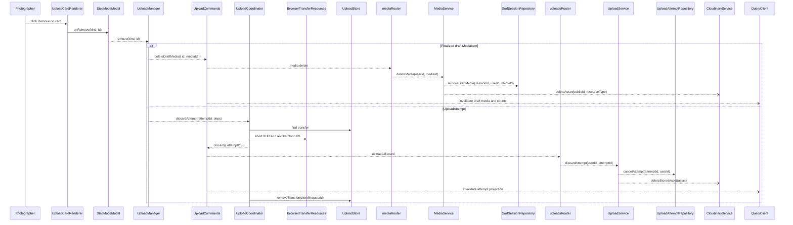

# Upload card cleanup post-fix review

## Happy path



## Error flow

```mermaid
sequenceDiagram
  participant Photographer
  participant UploadCardRenderer
  participant StepModeModal
  participant UploadManager
  participant UploadCommands
  participant UploadCoordinator
  participant BrowserTransferResources
  participant UploadStore
  participant mediaRouter
  participant MediaService
  participant SurfSessionRepository
  participant uploadsRouter
  participant UploadService
  participant UploadAttemptRepository
  participant CloudinaryService
  participant QueryClient
  alt Finalized draft MediaItem failure
    SurfSessionRepository-->>MediaService: ❌ throws mapped persistence error
    MediaService-->>mediaRouter: ❌ throws ownership or persistence error
    mediaRouter-->>UploadCommands: ❌ throws tRPC error
    UploadCommands-->>UploadManager: ❌ throws mutation error; no invalidation
    UploadManager-->>Photographer: returns-error — Delete Failed; card remains
  else UploadAttempt failure
    BrowserTransferResources-->>UploadCoordinator: abort/revoke completes before server result
    UploadAttemptRepository-->>UploadService: ❌ throws mapped persistence error
    UploadService-->>uploadsRouter: ❌ throws ownership or persistence error
    uploadsRouter-->>UploadCommands: ❌ throws tRPC error
    UploadCommands-->>UploadCoordinator: ❌ throws mutation error
    UploadCoordinator-->>UploadManager: ❌ throws after browser resources were released
    UploadManager-->>Photographer: returns-error — Delete Failed; dismantled card remains
    Note over BrowserTransferResources,UploadManager: [CONS-01] 🟡 medium — browser cleanup precedes authoritative discard
  end
```

## Architecture verdict

Ideal architecture: Upload owns a typed cleanup command that distinguishes transient UploadAttempts from finalized MediaItems. UploadService owns attempt cancellation/provider reconciliation; MediaService owns finalized media deletion/provider cleanup; the client mutation adapter owns cache invalidation. An active browser transfer may be aborted immediately, but its preview and visible state are released only after the authoritative server discard succeeds.

Recommended for this app: Keep the now-correct lifecycle dispatch and the `UPLOAD-003` ordering: abort the active transfer immediately, then dispose of its preview and visible state only after server discard succeeds. This is a small error-ordering correction, not another upload-system rewrite.

Transitional fix: Keep the current ordering and mark the surviving card failed after server discard rejection, accepting that its preview URL has already been revoked.

Why they differ: They do not differ for scale reasons. The recommended ordering is proportionate because it changes only browser resource timing while preserving all server ownership boundaries.

---

## [CONS-01] Browser resources are released before attempt discard succeeds

- **Priority**: medium
- **Status**: resolved
- **Category**: consistency
- **Location**: [src/features/Upload/model/uploadCoordinator.ts:117](src/features/Upload/model/uploadCoordinator.ts#L117), [src/features/Upload/model/browserTransferResources.ts:3](src/features/Upload/model/browserTransferResources.ts#L3), [src/features/Upload/model/useUploadManager.ts:50](src/features/Upload/model/useUploadManager.ts#L50)
- **Hop**: 4-10
- **Path**: error
- **Issue**: The photographer removes an active upload and expects either a successful disappearance or a retryable card when the server cannot confirm deletion. The coordinator currently aborts the XHR and revokes the blob preview before awaiting UploadAttempt cancellation; if that server mutation fails, the card remains but its browser resources are already gone, so the visible state no longer represents a usable transfer.
- **Fix**: Split browser cleanup into two operations. Abort active network transfer immediately, await the authoritative server discard, then revoke the preview and remove transfer state only on success; on failure, retain the preview and let the existing upload rejection mark the card retryable. Apply the same ordering to discard-all before closing the modal.
- **Resolution**: Attempt removal and discard-all now abort active local requests immediately but retain each transfer and blob preview until the authoritative server command succeeds. A failed discard leaves the visible card intact, and discard-all reports the failure through the Upload manager before rethrowing it to the modal caller.
- **Verification**: RED — focused manager tests showed both failed discard paths revoking their previews. GREEN — both paths retain the preview and transfer after rejection; 9 focused Upload tests, targeted ESLint, and the production build pass.

## [CON-01] Finalized media removal is routed as upload-attempt cancellation

- **Priority**: high
- **Status**: resolved
- **Category**: contract
- **Location**: [src/features/Upload/ui/UploadGallery/UploadCardRenderer.tsx:70](src/features/Upload/ui/UploadGallery/UploadCardRenderer.tsx#L70), [src/features/Upload/model/useUploadManager.ts:50](src/features/Upload/model/useUploadManager.ts#L50), [src/features/Upload/model/uploadCoordinator.ts:116](src/features/Upload/model/uploadCoordinator.ts#L116), [src/server/routes/media.ts:16](src/server/routes/media.ts#L16)
- **Hop**: 2-7
- **Path**: happy | error
- **Issue**: The photographer clicks Remove on a completed card and expects that finalized photo or video to disappear. The card sends `kind: "draft"` with a MediaItem ID, but `useUploadManager.remove` ignores the kind and always calls `discardAttempt`; after finalization the browser transfer is already gone, so the coordinator treats the MediaItem ID as an UploadAttempt ID and the server rejects it as not found. The visible card therefore remains and the photographer sees “Delete Failed.”
- **Fix**: Add one typed cleanup dispatcher in the Upload model: `attempt` routes to UploadAttempt discard and browser-transfer release; `draft` routes to the existing `media.delete` command, whose MediaService owner removes the finalized record and performs provider cleanup. Keep query invalidation in `useUploadCommands` so the gallery updates only after the owning mutation succeeds.
- **Resolution**: `useUploadManager.remove` now preserves the card kind. Draft cards invoke the MediaService-backed delete mutation and invalidate draft-media/count projections; attempt cards retain the UploadAttempt discard path. Browser abort/blob disposal is shared by attempt discard, retry, successful finalization, discard-all, and post-publish clearing through one Upload-model helper.
- **Verification**: RED — the focused manager test observed zero media-delete calls and one attempt-discard call for a draft card. GREEN — 7 focused Upload client tests, 10 MediaService cleanup tests, targeted ESLint, and the production build pass.

## [TEST-01] No focused test protects cleanup dispatch after the upload rewrite

- **Priority**: medium
- **Status**: resolved
- **Category**: testability
- **Location**: [src/features/Upload/model/useUploadManager.ts:50](src/features/Upload/model/useUploadManager.ts#L50), [src/features/Upload/model/uploadCoordinator.ts:116](src/features/Upload/model/uploadCoordinator.ts#L116)
- **Hop**: 3-5
- **Path**: happy | error
- **Issue**: The module has focused transport, publish, queue-policy, and UI tests, but no test exercises the runtime branch between attempt cancellation and finalized media deletion. That allowed the UI contract to retain `kind` while the rewritten manager silently ignored it.
- **Fix**: Add a focused Upload-model test that proves a `draft` card invokes media deletion and never attempt discard, while an `attempt` card invokes attempt discard and releases its browser resources. This is workflow policy at a runtime boundary, not a typed-field forwarding assertion.
- **Resolution**: Added focused manager tests for both runtime branches. The draft test protects lifecycle dispatch; the attempt test exercises the real upload store and proves abort, blob revocation, server discard, and visible transfer removal.
- **Verification**: Both tests pass with the focused Upload publish suite and targeted lint.
