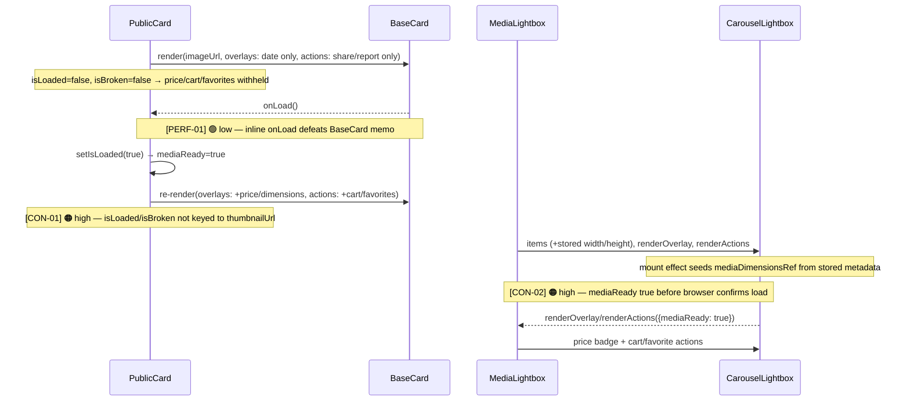
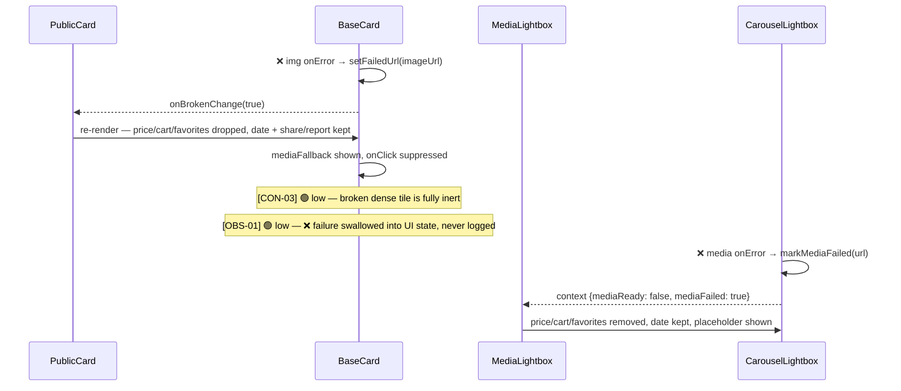

# Broken-src card mechanism review

## Happy path (thumbnail confirms loaded → price/actions revealed)



## Error flow (src fails → price/actions dropped)



---

## [CON-01] PublicCard broken/loaded state survives a thumbnail URL change
- **Priority**: high
- **Status**: resolved
- **Category**: contract
- **Location**: [PublicCard.tsx:151](src/features/PublicGallery/ui/cards/PublicCard.tsx#L151)
- **Hop**: 3
- **Path**: happy
- **Issue**: `isLoaded` and `isBroken` are bare booleans with no tie to `mediaItem.thumbnailUrl`. [BaseCard.tsx:76](src/shared/ui/BaseGallery/BaseCard.tsx#L76) deliberately keys its own failure state by URL so a reused card instance doesn't carry a stale failure onto a good image — but the consumer sitting directly on top of it undoes that defense. If a mounted PublicCard receives a different `thumbnailUrl` (same media id with a rotated/regenerated URL, or instance reuse the BaseCard comment explicitly anticipates), stale `isBroken: true` suppresses price/cart/favorites over a healthy image forever, and stale `isLoaded: true` shows price/cart optimistically while the new thumbnail is still unconfirmed — reintroducing the show-then-retract flash this mechanism exists to prevent. Related contract drift: `onBrokenChange?: (broken: boolean) => void` ([BaseCard.tsx:45](src/shared/ui/BaseGallery/BaseCard.tsx#L45)) implies recovery is reported, but BaseCard only ever calls it with `true`.
- **Fix**: Reset both flags when the URL changes, using the render-time reset pattern:
  ```tsx
  const [thumbState, setThumbState] = useState({ url: mediaItem.thumbnailUrl, loaded: false, broken: false });
  if (thumbState.url !== mediaItem.thumbnailUrl) {
    setThumbState({ url: mediaItem.thumbnailUrl, loaded: false, broken: false });
  }
  const mediaReady = thumbState.loaded && !thumbState.broken;
  ```
  with `onLoad`/`onBrokenChange` updating `thumbState` (stable callbacks via `useCallback`, which also resolves PERF-01). Why not have BaseCard call `onBrokenChange(false)` on URL change: that fixes only the broken flag, not stale `isLoaded`, and turns a simple derived-state problem into a callback protocol.

## [CON-02] Lightbox mediaReady is true before the browser confirms the media loads
- **Priority**: high
- **Status**: resolved
- **Category**: contract
- **Location**: [CarouselLightbox.tsx:276](src/shared/ui/CarouselLightbox/CarouselLightbox.tsx#L276)
- **Hop**: 6
- **Path**: happy
- **Issue**: `mediaReady = !!activeMediaDimensions && !mediaFailed`, but the mount effect at [CarouselLightbox.tsx:173](src/shared/ui/CarouselLightbox/CarouselLightbox.tsx#L173) seeds `mediaDimensionsRef` from stored DB `width`/`height` — added for frame sizing. For any item with stored dimensions (all new uploads now that dimensions persist), `mediaReady` is true at open, before a single byte is fetched. This contradicts the documented contract at [CarouselLightbox.tsx:101](src/shared/ui/CarouselLightbox/CarouselLightbox.tsx#L101) ("True once the active media has confirmed loaded") and makes MediaLightbox render price/cart/favorites immediately, then retract them when a broken src errors — the exact flash the comments in both files promise cannot happen. Tests miss it because the test fixture has no `width`/`height`, so the seeding path never runs. Trap for the fix: `adoptMediaDimensions` ([CarouselLightbox.tsx:162](src/shared/ui/CarouselLightbox/CarouselLightbox.tsx#L162)) early-returns without bumping the epoch when the load event reports the same dimensions as the seeded values, so load confirmation must be recorded before that early return.
- **Fix**: Track load confirmation separately from dimension knowledge. Add `confirmedUrlsRef` (a `Set<string>`), populated (with an epoch bump on first add, before the dimensions early-return) from the real load events — `onLoad`/`onLoadedMetadata` via `adoptMediaDimensions` — and from the successful `decode()` paths in `whenMediaReady` and the neighbor-preload effect (those decode successes genuinely confirm the file is good). Then `mediaReady = confirmedUrlsRef.current.has(activeItem.url) && !mediaFailed`. Add a lightbox test with stored `width`/`height` asserting price/cart stay hidden until `fireEvent.load`.

## [CON-03] Broken dense tile is completely inert
- **Priority**: low
- **Status**: open
- **Category**: consistency
- **Location**: [BaseCard.tsx:97](src/shared/ui/BaseGallery/BaseCard.tsx#L97)
- **Hop**: 4
- **Path**: error
- **Issue**: Suppressing `onClick` on broken media plus dense mode's "actions live in the lightbox" design leaves a broken dense tile with no interactions at all, while normal mode deliberately keeps Report reachable "e.g. reporting a broken listing". Low impact since the dense lightbox path has no report action today anyway.
- **Fix**: Accept for now, or allow the click through to the lightbox (which renders its own unavailable placeholder) once a report action exists there.

## [PERF-01] Inline onLoad arrow defeats BaseCard memoization
- **Priority**: low
- **Status**: resolved
- **Category**: performance
- **Location**: [PublicCard.tsx:210](src/features/PublicGallery/ui/cards/PublicCard.tsx#L210)
- **Hop**: 2
- **Path**: happy
- **Issue**: `onLoad={() => setIsLoaded(true)}` creates a fresh function every render, so `memo(BaseCard)` re-renders whenever PublicCard does — and parents re-render PublicCard freely via inline `actions`/`activeActions` arrays.
- **Fix**: Stable `useCallback` handler; falls out of the CON-01 fix.

## [OBS-01] Media load failures are swallowed with no telemetry
- **Priority**: low
- **Status**: open
- **Category**: observability
- **Location**: [BaseCard.tsx:85](src/shared/ui/BaseGallery/BaseCard.tsx#L85)
- **Hop**: 1
- **Path**: error
- **Issue**: A broken thumbnail or lightbox media file ([CarouselLightbox.tsx:156](src/shared/ui/CarouselLightbox/CarouselLightbox.tsx#L156)) is converted into UI state and never logged — but a broken src usually means a DB row pointing at a dead CDN asset, a data-integrity signal that is currently invisible.
- **Fix**: One `console.warn(<url>)` (or a reporting hook when one exists) in `handleImageError` and `markMediaFailed`.
