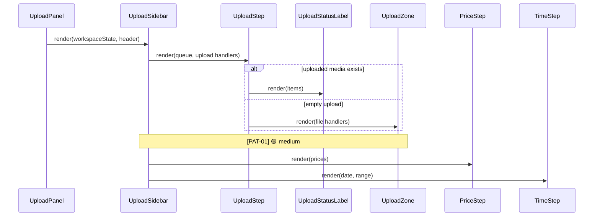
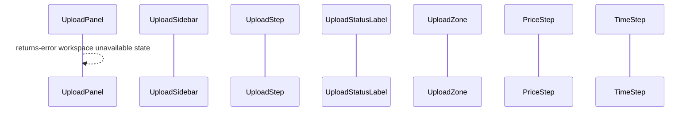

# Upload sidebar spacing review

## Happy path

## Error flow

---

## [PAT-01] Media section owns conflicting outer spacing
- **Priority**: medium
- **Status**: resolved
- **Category**: pattern
- **Location**: [UploadSidebar.tsx:264](src/features/Upload/ui/UploadSidebar.tsx#L264)
- **Hop**: 2
- **Path**: happy
- **Issue**: The sidebar stack owns a 16px gap between the controls the photographer sees, but the uploaded-media label adds a 12px inline margin and another 16px bottom margin in [UploadStatusLabel.module.css:2](src/features/Upload/ui/UploadGallery/UploadStatusLabel.module.css#L2), while the empty upload box independently adds the same mismatched outer spacing in [UploadZone.tsx:23](src/features/Upload/ui/UploadGallery/UploadZone.tsx#L23). The rendered media gutter is therefore 12px instead of the 16px used by spot, price, time, and footer, and the media-to-price gap doubles to 32px.
- **Fix**: Make the media section in [UploadSidebar.tsx:281](src/features/Upload/ui/UploadSidebar.tsx#L281) the sole owner of its 16px horizontal gutter; remove the child-level inline and bottom spacing from both media variants so the parent stack remains the sole owner of the 16px inter-section gap.
