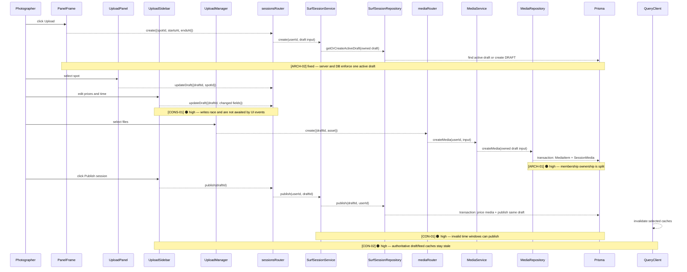

# ARCH-005 server-backed upload draft review

## Happy path



## Error flow

```mermaid
sequenceDiagram
  participant Photographer
  participant PanelFrame
  participant UploadPanel
  participant UploadSidebar
  participant UploadManager
  participant sessionsRouter
  participant SurfSessionService
  participant SurfSessionRepository
  participant mediaRouter
  participant MediaService
  participant MediaRepository
  participant Prisma
  participant QueryClient
  PanelFrame-->>Photographer: ❌ missing — createDraft rejection is detached
  Note over Photographer,PanelFrame: [CONS-02] 🟡 medium
  sessionsRouter-->>PanelFrame: ❌ throws tRPC error
  SurfSessionService-->>sessionsRouter: ❌ throws ownership/status error
  SurfSessionRepository-->>SurfSessionService: ❌ throws mapped persistence error
  UploadPanel-->>Photographer: ❌ missing — spot update rejection is unhandled
  UploadSidebar-->>Photographer: ❌ missing — price/time update rejection is unhandled
  UploadManager-->>Photographer: returns-error — card becomes failed and notification is shown
  mediaRouter-->>UploadManager: ❌ throws tRPC error
  MediaService-->>mediaRouter: ❌ throws and Drive import schedules asset cleanup
  MediaRepository-->>MediaService: ❌ throws and rolls back media membership
  SurfSessionRepository-->>SurfSessionService: ❌ throws and rolls back publish
  UploadSidebar-->>Photographer: returns-error — publish notification; queue stays open
  QueryClient-->>Photographer: ❌ missing — invalidation failures are fire-and-forget
```

## Architecture verdict

Ideal architecture: `SurfSession` is the aggregate root for one photographer upload draft; `SessionMedia` membership is changed only through that aggregate; draft creation is idempotent for the product's single active workflow; server policy validates the complete draft before publish; client state is only an edit/transport buffer; schema changes are delivered through reproducible migrations.

Recommended for this app: Build that ideal now. These are ownership, lifecycle, and persisted-contract boundaries that are expensive to retrofit, while none requires speculative scale infrastructure.

Transitional fix: Fix deletion/unlinking, cache invalidation, and server time validation first if the ownership move must be split across tasks. Treat that only as a safe intermediate state.

Why they differ: They do not differ for product-scale reasons; the transitional ordering exists only to keep each implementation step verifiable.

---

## [ARCH-02] The UI assumes one active draft but persistence permits many

- **Priority**: high
- **Status**: fixed
- **Category**: architecture
- **Location**: [src/app/routes/_panel.tsx:184](src/app/routes/_panel.tsx#L184), [src/server/repositories/SurfSessionRepository.ts:39](src/server/repositories/SurfSessionRepository.ts#L39), [prisma/schema.prisma:154](prisma/schema.prisma#L154)
- **Hop**: 1-5
- **Path**: happy | error
- **Issue**: The photographer sees and resumes only `latestDraft`, but every Upload click without a cached result creates another DRAFT row. A double-click, cache miss, or concurrent request can create two active drafts; only the most recently updated remains reachable from the UI, leaving the other draft and its media orphaned from the product lifecycle.
- **Fix**: Make the server command `getOrCreateActiveDraft(photographerId, initialFields)` atomic and enforce the single-active-draft invariant in PostgreSQL with a partial unique index for DRAFT status.
- **Resolution**: Added a partial unique PostgreSQL index on `photographer_id` for DRAFT rows. `SurfSessionRepository.getOrCreateActiveDraft` returns an existing draft, creates one when absent, and recovers from a concurrent unique collision by returning the winning row. The Upload button always invokes this server command and navigates with its returned draft ID, so the cached query is no longer lifecycle authority.
- **Verification**: RED — two concurrent real service requests persisted different draft IDs, and the panel navigated to a stale cached ID without invoking the server. GREEN — the same integration test returns one ID and one row, the panel uses the server result, 12 focused server tests and 2 focused client tests pass, targeted ESLint passes, the production build passes, and both test and development databases applied `20260622120500_one_active_surf_session_draft` successfully.
- **Remaining risk**: None for the single-active-draft invariant. Published sessions remain unrestricted history; draft edit ordering and post-publish cache invalidation remain separate queued issues.

## [CONS-01] Draft field writes can arrive out of order and silently revert the form

- **Priority**: high
- **Status**: resolved
- **Category**: consistency
- **Location**: [src/features/Upload/ui/UploadSidebar.tsx:68](src/features/Upload/ui/UploadSidebar.tsx#L68), [src/features/Upload/ui/steps/PriceStep.tsx:36](src/features/Upload/ui/steps/PriceStep.tsx#L36), [src/features/Upload/ui/steps/TimeStep.tsx:21](src/features/Upload/ui/steps/TimeStep.tsx#L21)
- **Hop**: 6-9
- **Path**: happy | error
- **Issue**: Every number-input change and every slider movement launches a detached mutation, then invalidates the same draft query. Network completion order—not user action order—can decide the persisted value, while the controlled inputs keep rendering the old server value until a refetch completes. A photographer dragging 06:00→07:00 can therefore see jitter and end with an older intermediate value stored after the final value.
- **Fix**: Keep a local, non-persisted edit buffer initialized from the draft; commit prices on blur and time range on `onChangeEnd`; serialize or supersede in-flight writes; and surface mutation failure without replacing the buffer. The server row remains authoritative after a successful commit.
- **Resolution**: `UploadSidebar` now owns the photographer's in-memory price/date/time edit buffer. Price fields commit on blur, date selection and the time slider commit only at their interaction boundaries, every server save runs through one ordered promise queue, failures notify without replacing the visible edit, and Publish waits for a final full-buffer save before invoking the publish mutation.
- **Verification**: RED — the focused component tests observed an immediate price mutation, concurrent second mutation, unchanged slider display, missing failure notice, and Publish running while a save was pending. GREEN — all 5 `UploadSidebar` behavior tests pass; the 11 related upload/route tests pass; targeted ESLint passes; `git diff --check` passes; and the production build passes. The full client suite passes 47 of 48 tests; the unrelated pre-existing `SessionDetail` failure is an incomplete `entities/Commerce` mock missing `useCartToggle`.
- **Remaining risk**: Uncommitted in-focus edits remain intentionally browser-memory-only until blur/change-end; durable offline file recovery is outside this issue. Spot-update error handling remains under CONS-02, server time policy remains under CON-01, and post-publish cache ownership remains under CON-02.

## [CON-01] Publish does not enforce the session time invariant on the server

- **Priority**: high
- **Status**: resolved
- **Category**: contract
- **Location**: [src/server/routes/sessions.ts:38](src/server/routes/sessions.ts#L38), [src/server/services/SurfSessionService.ts:51](src/server/services/SurfSessionService.ts#L51)
- **Hop**: 7, 17-20
- **Path**: happy | error
- **Issue**: The route validates each date independently and the service checks only that both dates exist. A direct client can persist `endsAt <= startsAt` and publish it, creating a visible real-world shoot whose end precedes its start; the client slider check is not authoritative server policy.
- **Fix**: In `updateDraft`, merge the patch with the persisted draft and reject a complete range unless `startsAt < endsAt`; repeat the invariant inside the transactional publish command so concurrent or legacy data cannot bypass it. Add service tests for reversed and equal ranges.
- **Resolution**: `SurfSessionService.updateDraft` now merges partial time patches with the persisted draft before rejecting equal or reversed complete windows. Both the service publish boundary and the repository's publish transaction reject an invalid current row before media or session status changes. PostgreSQL now owns the persisted invariant through `surf_sessions_valid_time_window_check`, which permits incomplete drafts but prevents every complete row from storing `starts_at >= ends_at`.
- **Verification**: RED — the service accepted a partial reversed update and an equal range at publish, the repository published media from a reversed legacy row, and real PostgreSQL persisted a reversed complete row. GREEN — 9 service tests, 5 repository tests, and 3 real-Postgres integration tests pass; the full 82-test server suite passes; targeted ESLint and `git diff --check` pass; and the production build/typecheck passes. Development contained zero invalid rows before deployment, both test and development databases applied `20260622140000_valid_surf_session_time_window`, and `prisma migrate status` reports the development schema is up to date.
- **Remaining risk**: None for the persisted session-window ordering invariant. Browser edit durability remains intentionally outside this issue, and publish cache ownership remains under CON-02.

## [ARCH-01] SurfSession media membership is owned by the Media repository

- **Priority**: high
- **Status**: resolved
- **Category**: architecture
- **Location**: [src/server/repositories/MediaRepository.ts:79](src/server/repositories/MediaRepository.ts#L79), [src/server/repositories/MediaRepository.ts:148](src/server/repositories/MediaRepository.ts#L148), [src/server/repositories/SurfSessionRepository.ts:289](src/server/repositories/SurfSessionRepository.ts#L289), [prisma/schema.prisma:108](prisma/schema.prisma#L108)
- **Hop**: 11-14, 19-20
- **Path**: happy | error
- **Issue**: ARCH-005 declares SurfSession the aggregate root, but `MediaRepository.createMedia` creates `SessionMedia`, while `hardDelete` and `hardDeleteBatch` delete MediaItem without removing that membership. Because the foreign key has no cascade, removing any attached draft media can fail; publish also filters memberships to currently valid draft media and can publish a subset instead of rejecting an inconsistent aggregate.
- **Fix**: Move add/remove membership commands to the SurfSession draft repository (or a narrowly named UploadDraft repository) and make each transaction update the link plus media together. Publish must load all memberships, reject if any member is unavailable/non-draft/foreign, then transition the complete aggregate. Adding cascade alone is insufficient because it does not fix ownership or partial publish.
- **Resolution**: Removed `SessionMedia` and replaced it with a required one-to-many `MediaItem.sessionId` relationship. A composite foreign key binds each media row to both its `SurfSession` and that session's photographer, while `SurfSessionRepository` now owns draft-media creation, single removal, batch removal, and complete-aggregate publication. Publish loads every attached row without filtering and rejects the entire transaction when any member is unavailable, non-draft, deleted, or foreign; the legacy direct media publish/unpublish commands were removed so session publication cannot be bypassed.
- **Verification**: RED — real PostgreSQL accepted a complete media row with no session. GREEN — PostgreSQL rejects sessionless media; 7 real-database lifecycle tests prove required ownership, atomic single and batch removal, rollback for mixed-session batches, complete-aggregate rejection, and successful atomic publish. All 75 server tests and 17 focused upload/client tests pass; targeted ESLint, Prisma validation, `git diff --check`, and the production build/typecheck pass. Both test and development databases applied `20260622192500_media_belongs_to_surf_session`, and development had zero sessionless rows, multi-session memberships, or photographer mismatches before deployment. The full client suite remains at 47 of 48 because the unrelated pre-existing `SessionDetail` test mock does not export `useCartToggle`.
- **Remaining risk**: Cloudinary deletion remains best-effort after the authoritative database removal, so a provider cleanup failure can leave an external orphaned asset; it cannot restore or corrupt the removed session membership and is logged for cleanup.

## [CON-02] Publish leaves the authoritative draft and public session caches stale

- **Priority**: high
- **Status**: resolved
- **Category**: contract
- **Location**: [src/features/Upload/model/usePublishUploadSession.ts:58](src/features/Upload/model/usePublishUploadSession.ts#L58), [src/entities/SurfSession/model/useSurfSessionDraft.ts:4](src/entities/SurfSession/model/useSurfSessionDraft.ts#L4)
- **Hop**: 16-21
- **Path**: happy
- **Issue**: Successful publish invalidates user/media queries but not `sessions.latestDraft`, `sessions.draft`, `sessions.draftMedia`, `sessions.list`, or `sessions.mine`. The panel can retain the just-published row as its “latest draft” and navigate back to a protected draft query that now rejects, while public session feeds can omit the new session until an unrelated refetch.
- **Fix**: Put SurfSession cache ownership in the SurfSession publish mutation hook and invalidate/remove the exact draft, latest draft, draft media, photographer sessions, and public session-list prefixes before navigation. Keep Upload responsible only for clearing transient upload resources.
- **Resolution**: `usePublishSession` now owns every post-publish cache consequence. It removes the obsolete exact draft and draft-media entries, awaits invalidation of the active-draft locator, every public session-list variant, photographer sessions, published session detail/media, and affected user/media projections before its mutation settles. `usePublishUploadSession` now waits for that owner and then performs only transient queue cleanup and navigation.
- **Verification**: RED — the SurfSession mutation completed without removing or invalidating any session cache, and Upload directly manipulated three server projections. GREEN — the focused SurfSession cache-coherence test and all 5 Upload publish behavior tests pass; the full client suite passes 48 of 49 tests, with only the unrelated pre-existing `SessionDetail` mock missing `useCartToggle`. Targeted ESLint, `git diff --check`, and the production build/typecheck pass; full-project `tsc --noEmit` reports only the existing test-only errors outside the changed files.
- **Remaining risk**: None for known client projections of session publication. A future projection introduced by another domain must subscribe to the same mutation owner rather than adding invalidation back into Upload.

## [ARCH-03] The schema change is not reproducible outside the manually updated database

- **Priority**: high
- **Status**: fixed
- **Category**: architecture
- **Location**: [prisma.config.ts:4](prisma.config.ts#L4), [prisma/schema.prisma:138](prisma/schema.prisma#L138), [vitest.globalSetup.integration.ts:12](vitest.globalSetup.integration.ts#L12)
- **Hop**: persistence prerequisite
- **Path**: happy | error
- **Issue**: Prisma is configured to deploy `prisma/migrations`, and integration setup calls `prisma migrate deploy`, but the migrations directory does not exist. ARCH-005 therefore required a manual development-database alteration, and a fresh test, CI, staging, or production database cannot reproduce the schema; this already manifested as P2022 missing-column failures.
- **Fix**: Establish a reviewed Prisma migration baseline for the current pre-launch schema, add the ARCH-005 draft migration with safe defaults/backfill, mark the baseline applied on the existing database, and make integration startup prove `migrate deploy` works on an empty database. Do not rely on ad-hoc `db push` or manual SQL as the delivery mechanism.
- **Resolution**: Added a generated baseline migration for the complete current schema. A read-only drift comparison found no difference between the development database and `schema.prisma`, so the baseline was recorded as applied without executing its table-creation SQL against existing data.
- **Verification**: RED — on an empty PostgreSQL test database, `npm run test:integration -- --run` deployed no migrations and failed because `public.session_media` did not exist. GREEN — the same command applied `00000000000000_baseline` and passed the real `SurfSessionRepository` integration test; the generated baseline is byte-for-byte identical to a fresh `prisma migrate diff --from-empty --to-schema` result; `prisma migrate status` reports the development database is up to date.
- **Remaining risk**: None for reproducibility of the current schema. Future schema changes must be delivered as incremental migrations rather than edits to this baseline.

## [CON-03] Direct `/upload` navigation renders a blank panel and the sidebar auth gate is unreachable

- **Priority**: medium
- **Status**: resolved
- **Category**: contract
- **Location**: [src/app/routes/_panel.upload.tsx:11](src/app/routes/_panel.upload.tsx#L11), [src/app/routes/_panel.upload.tsx:51](src/app/routes/_panel.upload.tsx#L51), [src/features/Upload/ui/UploadSidebar.tsx:15](src/features/Upload/ui/UploadSidebar.tsx#L15)
- **Hop**: entry
- **Path**: error
- **Issue**: The route accepts a missing `draftId` and then renders `null`, while `UploadSidebar` still contains an auth gate that cannot be reached because the protected draft must already have loaded before the sidebar mounts. A bookmark, stale link, or typed `/upload` URL produces an unexplained empty panel.
- **Fix**: Define an explicit route contract: redirect missing/invalid draft locators to the panel with a user-facing notice, or render a start/resume action that creates a draft only from an explicit event. Remove the unreachable sidebar auth gate once entry ownership is settled.
- **Resolution**: The upload route now owns every entry state before querying the protected draft. Signed-out visitors see a sign-in action, signed-in visitors without a locator see “No upload draft is open,” and stale or inaccessible locators see an unavailable-draft recovery state. “Start or resume upload” explicitly invokes the idempotent server command, replaces the bad URL with the authoritative returned draft ID, and the unreachable sidebar auth gate was removed.
- **Verification**: RED — missing, unavailable, and signed-out route states all rendered an empty panel. GREEN — all 4 upload-route behavior tests and all 5 sidebar behavior tests pass; the full client suite passes 51 of 52 tests, with only the unrelated pre-existing `SessionDetail` mock missing `useCartToggle`. The explaining skill's new fundamental-framing instruction has valid YAML frontmatter and Markdown structure; targeted ESLint, `git diff --check`, and the production build/typecheck pass, while full-project `tsc --noEmit` reports only existing test-only errors outside the changed route.
- **Remaining risk**: None for terminal upload-route entry states. A valid draft still shows a transient loading state while its authoritative server record is fetched.

## [CONS-02] Draft creation and map/form updates have no error disposition

- **Priority**: medium
- **Status**: resolved
- **Category**: consistency
- **Location**: [src/app/routes/_panel.tsx:184](src/app/routes/_panel.tsx#L184), [src/views/GlobeScene/GlobeScene.tsx:32](src/views/GlobeScene/GlobeScene.tsx#L32), [src/features/Upload/ui/UploadSidebar.tsx:68](src/features/Upload/ui/UploadSidebar.tsx#L68)
- **Hop**: 1, 6-9
- **Path**: error
- **Issue**: These UI events detach async mutations without a catch, notification, retry state, or rollback. A server or network rejection becomes an unhandled promise and leaves the photographer unsure whether the spot, price, time, or draft was saved.
- **Fix**: Await mutations inside named event handlers, expose pending/error state, notify on failure, and preserve the last editable value for retry. Use one consistent error contract for all draft edits.
- **Resolution**: The panel Upload action now runs through a named async handler that reports draft-creation failure and disables the button while the idempotent server command is pending. Globe spot selection now awaits the draft update, reports failure without changing the authoritative draft, ignores repeat selection while pending, and displays “Saving spot…”. Price and time edit failures were already resolved under CONS-01 through the serialized local edit buffer and consistent `Draft Save Failed` notification.
- **Verification**: RED — rejected Upload and map-spot mutations produced unhandled promises and no visible feedback, while pending actions accepted repeat clicks. GREEN — all 4 panel-entry tests, 2 globe-selection tests, and 5 sidebar edit tests pass; the full client suite passes 55 of 56 tests, with only the unrelated pre-existing `SessionDetail` mock missing `useCartToggle`. Targeted ESLint, `git diff --check`, and the production build/typecheck pass; full-project `tsc --noEmit` reports only existing test-only errors outside the changed files.
- **Remaining risk**: None for the reviewed draft actions. Failed form edits retain their local values for retry, while failed map selection leaves the last server-confirmed spot visible.

## [TEST-01] Tests prove call shapes but not the persisted draft lifecycle failures

- **Priority**: medium
- **Status**: resolved
- **Category**: testability
- **Location**: [src/server/repositories/MediaRepository.test.ts:33](src/server/repositories/MediaRepository.test.ts#L33), [src/server/repositories/SurfSessionRepository.integration.test.ts:21](src/server/repositories/SurfSessionRepository.integration.test.ts#L21), [src/app/routes/-_panel.upload.test.tsx:69](src/app/routes/-_panel.upload.test.tsx#L69)
- **Hop**: all
- **Path**: happy | error
- **Issue**: Repository tests mostly assert mocked Prisma calls, the one integration test covers only successful publish and cannot currently bootstrap through migrations, and route tests mock out the real Upload sidebar. No barrier covers attached-media deletion, duplicate active draft creation, out-of-order edits, invalid time publication, or post-publish cache behavior.
- **Fix**: After migrations work, add real-Postgres lifecycle tests for get-or-create, attach/remove, mixed-invalid membership, and atomic publish; add service tests for merged time invariants; add focused client tests for serialized edits and complete post-publish cache invalidation. Do not duplicate typed field-forwarding assertions across layers.
- **Resolution**: The draft lifecycle gaps (get-or-create, attach/remove, mixed membership, atomic publish, time invariants, serialized edits, post-publish cache) were filled by the individual issue fixes (ARCH-02, ARCH-01, CON-01, CONS-01, CON-02) using real-Postgres integration tests. The remaining mocked call-shape tests in `MediaRepository.test.ts` for `findByIdsForFulfillment` and `findPublishedBySpot` were replaced with real-Postgres integration tests in `MediaRepository.integration.test.ts` that prove actual filtering (PUBLISHED+priced+non-deleted), sort order, and cursor pagination using inserted rows. The `fileParallelism: false` option was added to the integration vitest project to prevent concurrent `beforeEach(clearTestData)` races when multiple integration test files run. All 12 integration tests and all 69 server unit tests pass.
- **Remaining risk**: The upload-route tests still mock the Upload sidebar, so no end-to-end route→sidebar→server path is covered; individual pieces (route, sidebar, server) each have their own focused tests.

## [PERF-01] The latest-draft query lacks its owning composite index

- **Priority**: low
- **Status**: resolved
- **Category**: performance
- **Location**: [src/server/repositories/SurfSessionRepository.ts:227](src/server/repositories/SurfSessionRepository.ts#L227), [prisma/schema.prisma:154](prisma/schema.prisma#L154)
- **Hop**: 1-2
- **Path**: happy
- **Issue**: `findLatestDraftByPhotographer` filters by photographer and status, then orders by `updatedAt`, but the schema indexes photographer with `createdAt` only. This is a current query path, not speculative scale work.
- **Fix**: Add a composite `(photographerId, status, updatedAt)` index in the migration that establishes the draft lifecycle.
- **Resolution**: Added `@@index([photographerId, status, updatedAt], map: "surf_sessions_photographer_draft_updated_idx")` to the `SurfSession` model in `prisma/schema.prisma`. `prisma migrate dev --name latest_draft_index` generated and applied `20260622184315_latest_draft_index`, which creates `CREATE INDEX "surf_sessions_photographer_draft_updated_idx" ON "surf_sessions"("photographer_id", "status", "updated_at")`. The index covers the exact filter and sort key used by `findLatestDraftByPhotographer`, allowing PostgreSQL to seek directly to `(photographer_id, status = 'DRAFT')` and read the first row by `updated_at` without a sort step.
- **Verification**: `prisma migrate status` reports "Database schema is up to date!" for both development and test databases. All 69 server unit tests and 12 real-Postgres integration tests pass.
- **Remaining risk**: None for this query path. The existing `(photographerId, createdAt)` index remains; it supports the `findByPhotographer` published-sessions query and is unrelated to the draft path.

## [DUP-01] SurfSession draft mapping is copied across repository reads

- **Priority**: low
- **Status**: resolved
- **Category**: duplication
- **Location**: [src/server/repositories/SurfSessionRepository.ts:56](src/server/repositories/SurfSessionRepository.ts#L56), [src/server/repositories/SurfSessionRepository.ts:210](src/server/repositories/SurfSessionRepository.ts#L210), [src/server/repositories/SurfSessionRepository.ts:238](src/server/repositories/SurfSessionRepository.ts#L238)
- **Hop**: persistence reads
- **Path**: happy
- **Issue**: The same 13-field draft mapping is repeated in create, by-id, and latest-draft paths. A later field addition can update one projection but not the others, recreating the contract drift ARCH-005 was intended to remove.
- **Fix**: Define one repository-local draft select/include and mapper, then reuse it in all three reads; keep it private rather than adding another public abstraction.
- **Resolution**: Extracted a module-private `draftInclude` (`satisfies Prisma.SurfSessionInclude`) and `mapToDraft` function. All three read paths (`getOrCreateActiveDraft` post-create, `findDraftById`, `findLatestDraftByPhotographer`) now use both. Also fixed a latent `_count` inconsistency in the post-create include which was counting all media instead of non-deleted media (harmless on a newly created draft, but mismatched the contract of the other two paths).
- **Verification**: 69 server unit tests and 12 real-Postgres integration tests pass.
- **Remaining risk**: None. A future `SurfSessionDraft` field addition requires a single change in `mapToDraft` and the `draftInclude` shape.

## Prior review disposition

The earlier upload-panel findings are now resolved by ARCH-005: loader errors no longer clear browser-owned draft state, the flash callback is direct, and the imperative map upload-handler bus was removed.
